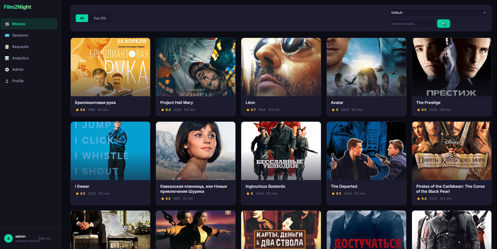
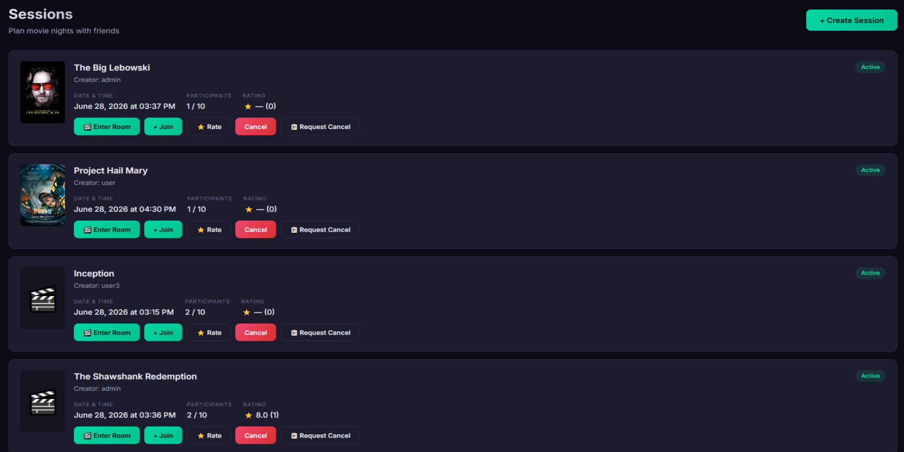
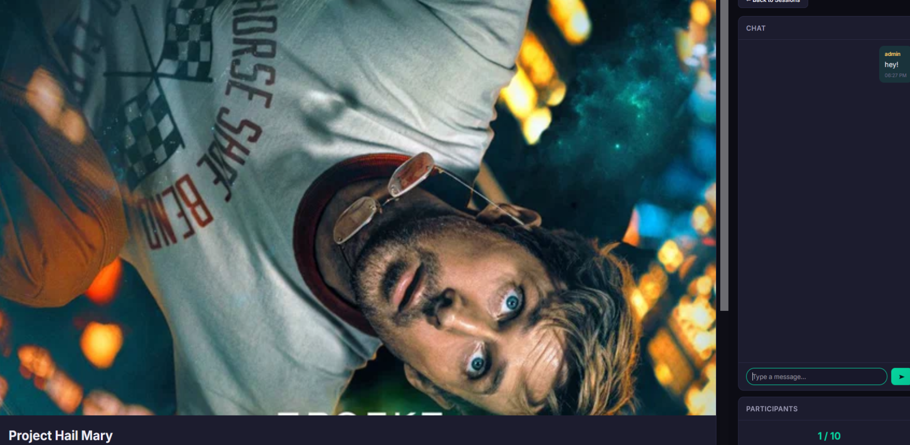
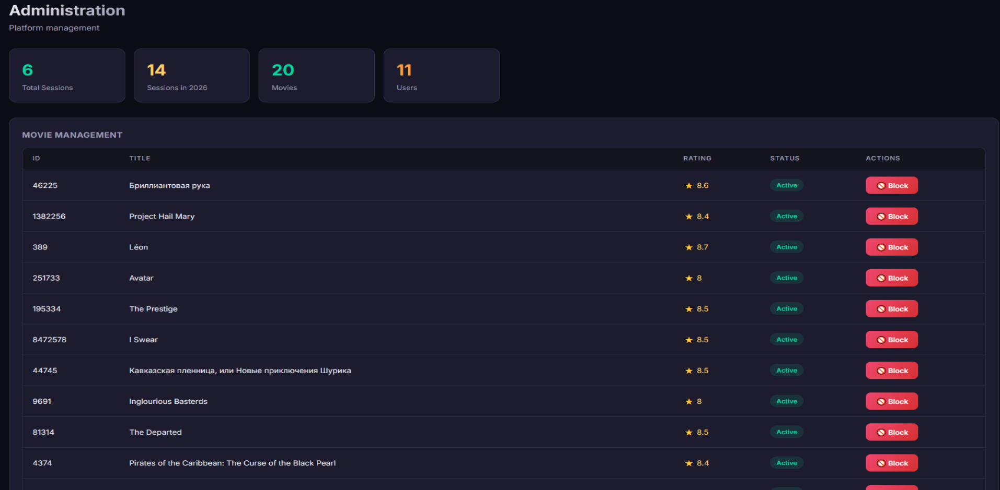

# Film2Night Main

A platform for managing movie watch parties. Create sessions, invite others, chat and rate films.

REST API + frontend on port **8181**. Requires a PostgreSQL database and optionally the [Loader service](https://github.com/nazarhovar/Film2Night) for fetching films from Kinopoisk API.

## Screenshots

Click to expand

## Features

- User registration & JWT auth with role-based access (USER / MODERATOR / ADMIN)
- Film catalog with search, pagination, and TOP-250
- Session creation, join, cancel
- Session rating system
- Bid system for moderator/admin actions (add user, delete session/film, block user)
- Admin dashboard with analytics 

## Stack

**Backend:** Spring Boot, Spring Security, Spring Data JPA, PostgreSQL
**Frontend:** Vanilla JS, HTML/CSS 
